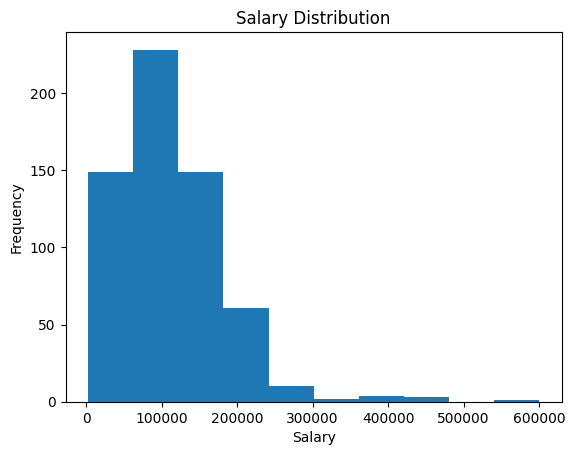
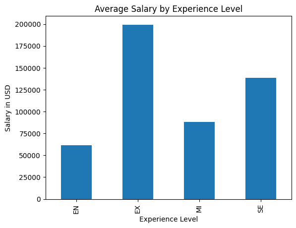
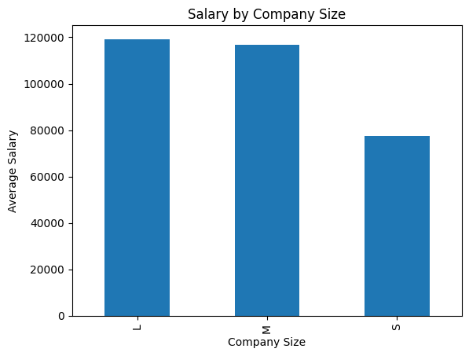
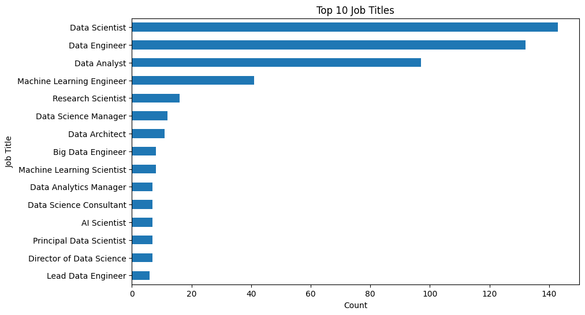
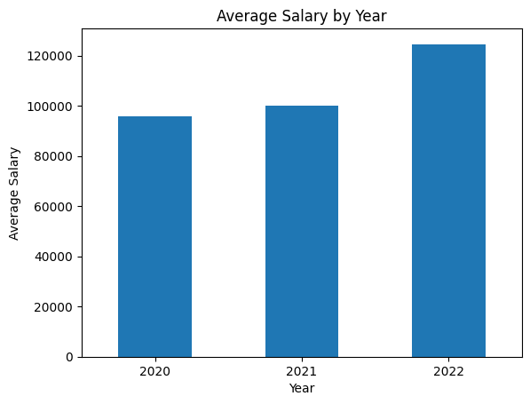

# Data Science Salaries Analysis

## 📊 Project Overview

This project explores salary trends in the Data Science industry using Python and Jupyter Notebook.

The analysis focuses on factors such as experience level, company size, remote work ratio, employment type, and geographical distribution.

##  Technologies Used

* Python
* Pandas
* NumPy
* Matplotlib
* Jupyter Notebook

## 📈 Key Analyses

* Salary Distribution Analysis
* Salary by Experience Level
* Salary by Company Size
* Salary by Remote Work Ratio
* Top Job Titles Analysis
* Employment Type Distribution
* Top Employee Countries Analysis
* Salary Trend by Year

## Project Structure

* DS_Salaries_Analysis.ipynb
* ds_salaries.csv
* images/
* README.md

## Author

Niraj Patel

## 📷 Visualizations

### Salary Distribution

### Salary by Experience Level

### Salary by Company Size

### Top Job Titles

### Salary Trend by Year

